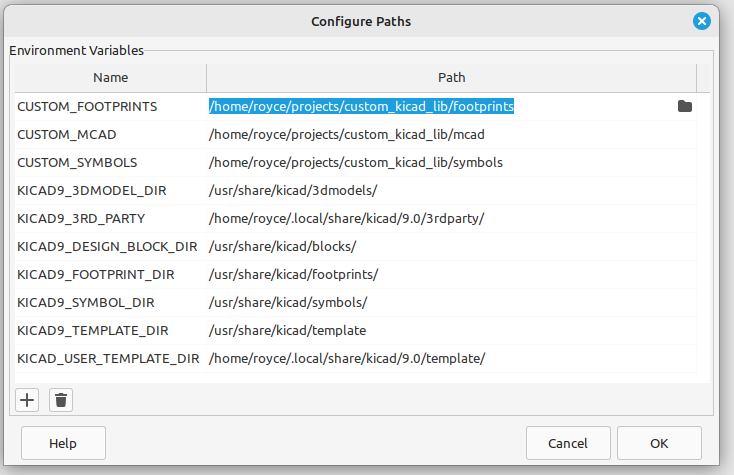

# CUSTOM KICAD LIB
This repository contains custom KiCad components for PCB design designed by Justin Royce.

The author of this repository is Justin Royce.
Contact him with the following email: justin.g.royce@gmail.com

# KICAD FOLDER STRUCTURE

Custom KiCad libraries includes the following directories:
 
- **symbols** - directory that contain kicad schematic parts (.kicad_sym, .bak).

- **footprints** - directories with *.pretty* folders that hold kicad footprints parts (*.kicad_mod*).

- **mcad** - mechanical step files for 3D PCB CAD located in *.3dshapes* folders.

# SETTING KICAD PATHS

 Select *Preference* --> *Configure Paths ...* to access Configure Paths dialog box shown below.

*custom_kicad_lib* is the root directory for the repository.  

Set the following environmental paths follow the table below:

| Environment Variable Name | Path |
| -------- | -------- |
| **CUSTOM_FOOTPRINTS** | */custom_kicad_lib/footprints* |
| **CUSTOM_MCAD** | */custom_kicad_lib/mcads* | 
| **CUSTOM_SYMBOLS** | */custom_kicad_lib/symbols* |

